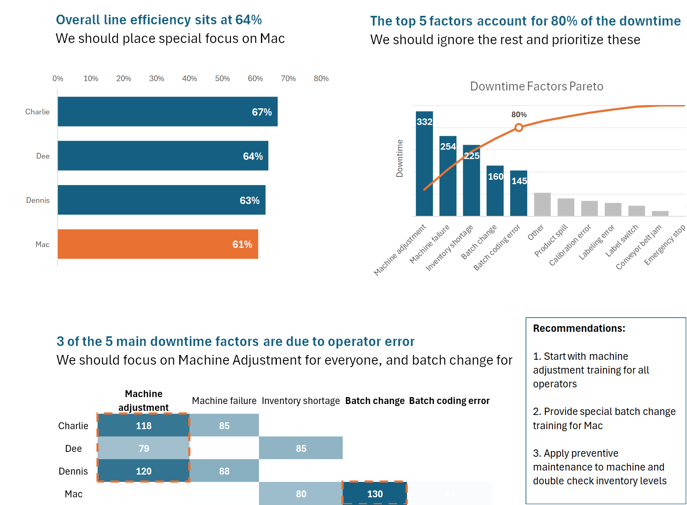

&nbsp;

&nbsp;

## Manufacturing Downtime Analysis

Identify productivity improvement opportunities in a production line.

# Objectives

The project had the following goals:

- Calculate line efficiency, and break it down by operator
- Identify main downtime factors, using a Pareto chart
- Calculate downtime by operator and factor